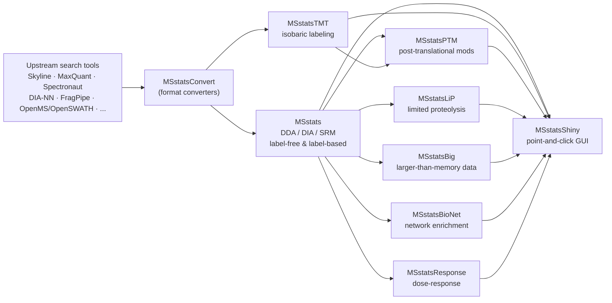

# MSstats

<!-- badges: start -->
[](https://bioconductor.org/checkResults/release/bioc-LATEST/MSstats/)
[](https://bioconductor.org/checkResults/devel/bioc-LATEST/MSstats/)
[](https://codecov.io/gh/Vitek-Lab/MSstats)
[](https://bioconductor.org/packages/stats/bioc/MSstats/)
[](https://bioconductor.org/packages/release/bioc/html/MSstats.html#since)
[](https://opensource.org/licenses/Artistic-2.0)
<!-- badges: end -->

MSstats is an R/Bioconductor package for statistical relative quantification of
proteins and peptides in mass spectrometry-based proteomics experiments. It
supports label-free and label-based (isotope-labeled reference peptide/protein)
workflows, and is applicable to targeted Selected Reaction Monitoring (SRM),
Data-Dependent Acquisition (DDA/shotgun), and Data-Independent Acquisition
(DIA/SWATH-MS) experiments, including designs with fractionation. Given
identified and quantified peaks from upstream tools (Skyline, MaxQuant,
Proteome Discoverer, Spectronaut, DIA-NN, FragPipe, OpenSWATH, and others),
MSstats performs normalization, missing value handling, run-level
summarization, and model-based statistical testing to detect differentially
abundant proteins or peptides across conditions. Because the underlying
statistical framework operates on generic quantitative features rather than
anything protein-specific, it is general enough to apply to other
targeted/SRM- or DIA-style quantitative signals as well, such as targeted
metabolomics data.

MSstats has been developed and maintained by the [Vitek Lab](https://olga-vitek-lab.khoury.northeastern.edu/)
at the Khoury College of Computer Sciences, Northeastern University, since
2012. The package and its documentation are also available at
[msstats.org](http://msstats.org).

This repository is used for active development and testing of MSstats. The
package is released through [Bioconductor](https://bioconductor.org/packages/MSstats)
on its regular 6-month release cycle.

## At a Glance

- **13+ years** in Bioconductor (since release 2.13, 2013)
- **9 packages** in the MSstats ecosystem, covering DDA/DIA/SRM, TMT, PTMs,
  LiP-MS, large-scale/out-of-memory data, network analysis, dose-response, and
  a no-code GUI
- **9 peer-reviewed publications / preprints**, [~1,700+ citations](#citations)
  combined (see [Citations](#citations))
- **Thousands of downloads per month** across the ecosystem (see
  [Download statistics](#download-statistics)), tracked automatically from
  Bioconductor's own logs

## The MSstats Ecosystem

MSstats has grown into a family of packages that share the same statistical
framework and data model, each targeting a different experiment type or stage
of the analysis pipeline:



| Package | Description |
| --- | --- |
| **[MSstats](https://bioconductor.org/packages/MSstats)** | Core package for DDA, SRM, and DIA label-free/label-based experiments. |
| **[MSstatsTMT](https://bioconductor.org/packages/MSstatsTMT)** ([GitHub](https://github.com/Vitek-Lab/MSstatsTMT)) | Statistical analysis of experiments with isobaric (TMT) labeling and multiple mixtures, including repeated-measures designs. |
| **[MSstatsPTM](https://bioconductor.org/packages/MSstatsPTM)** ([GitHub](https://github.com/Vitek-Lab/MSstatsPTM)) | Quantitative analysis of post-translational modifications (PTMs), jointly modeling PTM-site and protein-level abundance. |
| **[MSstatsLiP](https://bioconductor.org/packages/MSstatsLiP)** ([GitHub](https://github.com/Vitek-Lab/MSstatsLiP)) | Analysis of limited proteolysis mass spectrometry (LiP-MS) data to detect protein structural changes. |
| **[MSstatsBig](https://bioconductor.org/packages/MSstatsBig)** ([GitHub](https://github.com/Vitek-Lab/MSstatsBig)) | Converters and tooling for processing larger-than-memory quantitative datasets. |
| **[MSstatsShiny](https://bioconductor.org/packages/MSstatsShiny)** ([GitHub](https://github.com/Vitek-Lab/MSstatsShiny) · [web app](https://www.msstatsshiny.com)) | Point-and-click R-Shiny GUI integrating MSstats, MSstatsTMT, and MSstatsPTM for code-free analysis. |
| **[MSstatsBioNet](https://bioconductor.org/packages/MSstatsBioNet)** ([GitHub](https://github.com/Vitek-Lab/MSstatsBioNet)) | Network analysis and enrichment of MSstats differential abundance results using prior-knowledge networks (e.g., INDRA). |
| **[MSstatsResponse](https://bioconductor.org/packages/MSstatsResponse)** ([GitHub](https://github.com/Vitek-Lab/MSstatsResponse)) | Semi-parametric dose-response modeling for chemoproteomics experiments (drug-protein interaction / IC50 estimation). |
| **[MSstatsConvert](https://bioconductor.org/packages/MSstatsConvert)** ([GitHub](https://github.com/Vitek-Lab/MSstatsConvert)) | Shared converters that translate output from Skyline, MaxQuant, Proteome Discoverer, Spectronaut, DIA-NN, FragPipe, OpenSWATH, and more into MSstats format. |

MSstatsResponse's semi-parametric curve-fitting approach to dose-response data
generalizes beyond drug-protein interaction/IC50 estimation: the same concept
applies to related experiment types such as Thermal Proteome Profiling (TPP)
and protein turnover kinetics, where abundance is likewise modeled as a smooth
function of a continuous variable (temperature or time) rather than a fixed
curve shape.

## Developers

MSstats is developed and maintained out of the [Vitek Lab](https://olga-vitek-lab.khoury.northeastern.edu/)
at Northeastern University.

Current developers:

- Devon Kohler
- Anthony Wu
- Mateusz Staniak
- Sarah Szvetecz

Former developers include Meena Choi, Deril Raju, Tsung-Heng Tsai, Ting Huang,
and Olga Vitek. See the full author list in [DESCRIPTION](DESCRIPTION) and the
lab's [publications page](https://olga-vitek-lab.khoury.northeastern.edu/publications/)
for the wider set of contributors across the MSstats ecosystem.

The lab also organizes the annual [May Institute](https://computationalproteomics.khoury.northeastern.edu/),
a computational proteomics training program at Northeastern University
covering mass spectrometry, statistics, and bioinformatics, which regularly
features MSstats developers as instructors.

## Installation

```r
if (!requireNamespace("BiocManager", quietly = TRUE))
    install.packages("BiocManager")

BiocManager::install("MSstats")
```

The development version can be installed directly from this repository:

```r
BiocManager::install("Vitek-Lab/MSstats", ref = "devel")
```

## Quick Start

```r
library(MSstats)

# Use one of the datasets bundled with the package (label-based SRM example)
data("SRMRawData")

# Pre-process: log-transform, normalize, and summarize to protein level
QuantData <- dataProcess(SRMRawData, use_log_file = FALSE)

# Test all pairwise comparisons between conditions
testResults <- groupComparison(contrast.matrix = "pairwise",
                                data = QuantData,
                                use_log_file = FALSE)

head(testResults$ComparisonResult)
```

Real experiments typically start by converting a search engine/tool's output
(e.g., Skyline, MaxQuant, Spectronaut, DIA-NN, FragPipe) into MSstats format
with a `*toMSstatsFormat` converter from `MSstatsConvert`, then proceeding with
`dataProcess()` and `groupComparison()` as above. See the vignettes below for
complete, tool-specific examples.

## Supported Converters

MSstats does not read raw search-tool output directly. Instead, a converter
translates each tool's report into MSstats format (one row per feature, run,
and condition) before `dataProcess()` is called. These converters are
implemented in [MSstatsConvert](https://bioconductor.org/packages/MSstatsConvert)
and re-exported directly from MSstats, so they're available as soon as you
`library(MSstats)`:

| Search tool / format | Converter function |
| --- | --- |
| Skyline | `SkylinetoMSstatsFormat()` |
| MaxQuant | `MaxQtoMSstatsFormat()` |
| Progenesis | `ProgenesistoMSstatsFormat()` |
| Spectronaut | `SpectronauttoMSstatsFormat()` |
| Proteome Discoverer | `PDtoMSstatsFormat()` |
| DIA-NN | `DIANNtoMSstatsFormat()` |
| DIA-Umpire | `DIAUmpiretoMSstatsFormat()` |
| FragPipe | `FragPipetoMSstatsFormat()` |
| OpenMS | `OpenMStoMSstatsFormat()` |
| OpenSWATH | `OpenSWATHtoMSstatsFormat()` |

MSstatsConvert also provides a `MetamorpheusToMSstatsFormat()` converter
(`MSstatsConvert::MetamorpheusToMSstatsFormat()`) that isn't yet re-exported
from MSstats directly, and a set of `*toMSstatsTMTFormat()` converters
(MaxQuant, OpenMS, Proteome Discoverer, Philosopher/FragPipe, Protein
Prospector, SpectroMine) for isobaric-labeling experiments, used with
[MSstatsTMT](https://bioconductor.org/packages/MSstatsTMT) instead of MSstats.
See the [End to End Workflow vignette](vignettes/MSstatsWorkflow.Rmd) for the
required input files and options for each converter.

## Documentation

- [MSstats: Protein/Peptide significance analysis](vignettes/MSstats.Rmd) — overview of all functionality
- [MSstats: End to End Workflow](vignettes/MSstatsWorkflow.Rmd) — full worked example from raw data to results
- [MSstats+ vignette](vignettes/MSstatsPlus.Rmd)
- [Official website: msstats.org](http://msstats.org)
- [Bioconductor package page and reference manual](https://bioconductor.org/packages/MSstats)

## Getting Help / Reporting Bugs

- **Questions about usage, statistical methods, or troubleshooting:** please
  post to the [MSstats Google Group](https://groups.google.com/forum/#!forum/msstats).
  This is monitored by the development team and searchable, so it's the
  fastest way to get help and to see if your question has already been
  answered.
- **Bug reports and feature requests for this repository:** please open a
  [GitHub issue](https://github.com/Vitek-Lab/MSstats/issues).

## Usage & Impact

MSstats has been part of Bioconductor since release 2.13 (2013) and is used
across the proteomics community, integrated as an external tool in Skyline and
underlying the MSstats family of packages and MSstatsShiny.

### Citations

<!-- CITATION-STATS:START -->

_Citation counts from [OpenAlex](https://openalex.org), updated monthly. Google Scholar counts are typically higher, since Scholar indexes a broader range of sources (theses, gray literature, etc.); OpenAlex has a free, stable, official API. Last updated 2026-07-15 (UTC)._

| Paper | Citations |
| --- | --- |
| [MSstats (2014)](https://doi.org/10.1093/bioinformatics/btu305) | 1,158 |
| [MSstats 4.0 (2023)](https://doi.org/10.1021/acs.jproteome.2c00834) | 134 |
| [MSstats + FragPipe DIA workflow (2024)](https://doi.org/10.1038/s41596-024-01000-3) | 13 |
| [MSstatsTMT (2020)](https://doi.org/10.1074/mcp.RA120.002105) | 203 |
| [MSstatsTMT repeated measures (2023)](https://doi.org/10.1021/acs.jproteome.3c00155) | 14 |
| [MSstatsPTM (2022)](https://doi.org/10.1016/j.mcpro.2022.100477) | 53 |
| [MSstatsLiP / LiP-MS protocol (2023)](https://doi.org/10.1038/s41596-022-00771-x) | 127 |
| [MSstatsShiny (2023)](https://doi.org/10.1021/acs.jproteome.2c00603) | 23 |
| [MSstatsResponse (2026, preprint)](https://doi.org/10.64898/2026.03.09.710598) | 1 |
| **Total** | **1,726** |

<!-- CITATION-STATS:END -->

This table is regenerated automatically alongside the download statistics
below by
[`.github/workflows/update-citation-stats.yaml`](.github/workflows/update-citation-stats.yaml),
using [OpenAlex](https://openalex.org) rather than Google Scholar — Scholar
has no official API and blocks automated requests, which makes it unreliable
for an unattended scheduled job. If you'd like exact Google Scholar counts,
see the [MSstats citations search](https://scholar.google.com/scholar?q=MSstats+Vitek+proteomics)
directly.

### Download statistics

<!-- DOWNLOAD-STATS:START -->

_Average monthly downloads over the last 6 complete months, computed directly from Bioconductor's download logs. Last updated 2026-07-15 (UTC)._

| Package | Avg. monthly downloads |
| --- | --- |
| [MSstats](https://bioconductor.org/packages/stats/bioc/MSstats/) | 1,566 |
| [MSstatsTMT](https://bioconductor.org/packages/stats/bioc/MSstatsTMT/) | 796 |
| [MSstatsPTM](https://bioconductor.org/packages/stats/bioc/MSstatsPTM/) | 632 |
| [MSstatsLiP](https://bioconductor.org/packages/stats/bioc/MSstatsLiP/) | 442 |
| [MSstatsBig](https://bioconductor.org/packages/stats/bioc/MSstatsBig/) | 384 |
| [MSstatsShiny](https://bioconductor.org/packages/stats/bioc/MSstatsShiny/) | 437 |
| [MSstatsBioNet](https://bioconductor.org/packages/stats/bioc/MSstatsBioNet/) | 311 |
| [MSstatsResponse](https://bioconductor.org/packages/stats/bioc/MSstatsResponse/) | 298 |
| [MSstatsConvert](https://bioconductor.org/packages/stats/bioc/MSstatsConvert/) | 1,100 |

<!-- DOWNLOAD-STATS:END -->

This table is regenerated automatically once a month by
[`.github/workflows/update-download-stats.yaml`](.github/workflows/update-download-stats.yaml),
which pulls the latest numbers from
[Bioconductor's download logs](https://bioconductor.org/packages/stats/bioc/MSstats/)
for every package in the ecosystem.

## References

If you use MSstats or a package from the MSstats ecosystem, please cite the
relevant publication(s):

1. Choi M, Chang CY, Clough T, Broudy D, Killeen T, MacLean B, Vitek O.
   **MSstats: an R package for statistical analysis of quantitative mass
   spectrometry-based proteomic experiments.** *Bioinformatics*. 2014;30(17):2524-2526.
   [DOI: 10.1093/bioinformatics/btu305](https://doi.org/10.1093/bioinformatics/btu305)
2. Kohler D, Staniak M, Tsai TH, Huang T, Shulman N, Bernhardt OM, MacLean BX,
   Nesvizhskii AI, Reiter L, Sabido E, Choi M, Vitek O. **MSstats Version 4.0:
   Statistical Analyses of Quantitative Mass Spectrometry-Based Proteomic
   Experiments with Chromatography-Based Quantification at Scale.**
   *J Proteome Res*. 2023;22(5):1466-1482.
   [DOI: 10.1021/acs.jproteome.2c00834](https://doi.org/10.1021/acs.jproteome.2c00834)
3. Kohler D, Vitek O, et al. **An MSstats workflow for detecting differentially
   abundant proteins in large-scale data-independent acquisition mass
   spectrometry experiments with FragPipe processing.** *Nat Protoc*.
   2024;19:2915-2938.
   [DOI: 10.1038/s41596-024-01000-3](https://doi.org/10.1038/s41596-024-01000-3)
4. Huang T, Choi M, Tzouros M, Golling S, Pandya NJ, Banfai B, Dunkley T,
   Vitek O. **MSstatsTMT: Statistical Detection of Differentially Abundant
   Proteins in Experiments with Isobaric Labeling and Multiple Mixtures.**
   *Mol Cell Proteomics*. 2020;19(10):1706-1723.
   [DOI: 10.1074/mcp.RA120.002105](https://doi.org/10.1074/mcp.RA120.002105)
5. Huang T, Staniak M, da Veiga Leprevost F, Figueroa-Navedo AM, Ivanov AR,
   Nesvizhskii AI, Choi M, Vitek O. **Statistical Detection of Differentially
   Abundant Proteins in Experiments with Repeated Measures Designs and
   Isobaric Labeling.** *J Proteome Res*. 2023;22(8):2641-2659.
   [DOI: 10.1021/acs.jproteome.3c00155](https://doi.org/10.1021/acs.jproteome.3c00155)
6. Kohler D, Tsai TH, Verschueren E, Huang T, Hinkle T, Phu L, Choi M, Vitek O.
   **MSstatsPTM: Statistical Relative Quantification of Posttranslational
   Modifications in Bottom-Up Mass Spectrometry-Based Proteomics.**
   *Mol Cell Proteomics*. 2022;22(1):100477.
   [DOI: 10.1016/j.mcpro.2022.100477](https://doi.org/10.1016/j.mcpro.2022.100477)
7. Malinovska L, Cappelletti V, Kohler D, Piazza I, Tsai TH, Pepelnjak M,
   Stalder P, Dörig C, Sesterhenn F, Elsässer F, Kralickova L, Beaton N,
   Reiter L, de Souza N, Vitek O, Picotti P. **Proteome-wide structural
   changes measured with limited proteolysis-mass spectrometry: an advanced
   protocol for high-throughput applications** (introduces MSstatsLiP).
   *Nat Protoc*. 2023;18(3):659-682.
   [DOI: 10.1038/s41596-022-00771-x](https://doi.org/10.1038/s41596-022-00771-x)
8. Kohler D, Kaza M, Pasi C, Huang T, Staniak M, Mohandas D, Sabido E, Choi M,
   Vitek O. **MSstatsShiny: A GUI for Versatile, Scalable, and Reproducible
   Statistical Analyses of Quantitative Proteomic Experiments.**
   *J Proteome Res*. 2023;22(2):551-556.
   [DOI: 10.1021/acs.jproteome.2c00603](https://doi.org/10.1021/acs.jproteome.2c00603)
9. Szvetecz S, Kohler D, Vitek O. **MSstatsResponse: Semi-parametric
   statistical model enhances detection of drug-protein interactions in
   chemoproteomics experiments.** *bioRxiv*. 2026.
   [DOI: 10.64898/2026.03.09.710598](https://doi.org/10.64898/2026.03.09.710598)

MSstatsBioNet does not yet have a dedicated publication; see the
[Bioconductor package page](https://bioconductor.org/packages/MSstatsBioNet)
for details and how to cite the software directly.

## Funding

MSstats development has been supported by the Chan Zuckerberg Initiative's
[Essential Open Source Software for Science](https://chanzuckerberg.com/eoss/proposals/)
program (Cycle 1, 2019), through the award *"MSstats and Cardinal: Next
Generation Statistical Mass Spectrometry in R"* (PI: Olga Vitek).

## License

MSstats is released under the [Artistic-2.0](https://opensource.org/licenses/Artistic-2.0) license.
